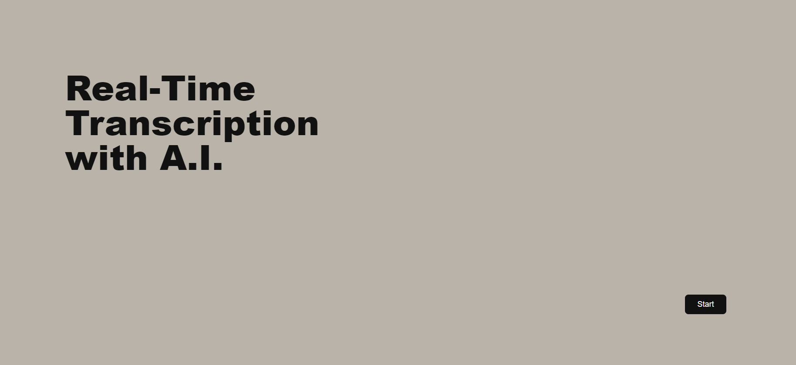

# Reti-AI is a transcription app
   * this projects is made with Assembly-AI transcription API. 
   
   
# Stack Used :
   * Html
   * Css
   * Javascript
   * Node.js
   * WebRTC
   
   
# Screenshots of the project ⬇️

# live demo: 

   * live demo wont work, because I removed the api token for no reason.
   * link for the live demo: https://unruffled-elion-40cb7a.netlify.app/ 
   

# Run App
  * create an account on assemble ai 
  * copy the api token id in server.js 
  * Open a terminal session at the parent directory "real-time-example"
  * Run `npm i` to ensure all needed modules are installed
  * Add your AssemblyAI Token to line 13 in `./js/server.js`
  * Spin up the server to get your temporary auth token using `npm start`
  * Open a new terminal at the parent directory and serve the project with `serve .`
